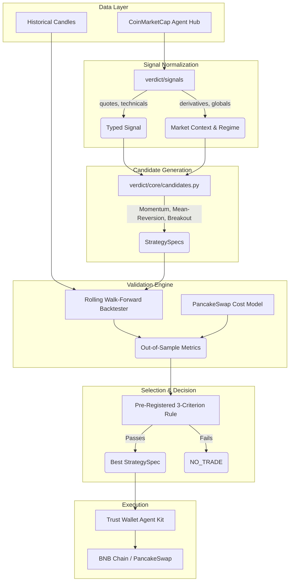

# VERDICT — Architecture

VERDICT is an LLM-authored crypto strategy engine designed to act like an honest quantitative researcher. It evaluates strategies rigorously using a multi-stage pipeline, outputting a highly-validated `AgentVerdict`.

## Data Flow

## The 3-Layer Sponsor Stack

1. **Data & Signal Layer**: Powered by **CoinMarketCap Agent Hub**. We leverage MCP/REST to pull rich pricing, technicals, Fear & Greed, BTC dominance, funding rates, and open interest to dynamically tune strategy parameters based on market regimes.
2. **Strategy execution**: **Trust Wallet Agent Kit (TWAK)** handles the secure custody and local signing of trades, governed by strict drawdown kill-switches.
3. **Execution venue**: Trades are executed directly on the **BNB Chain** via **PancakeSwap v2** router smart contracts.
